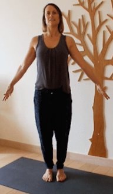
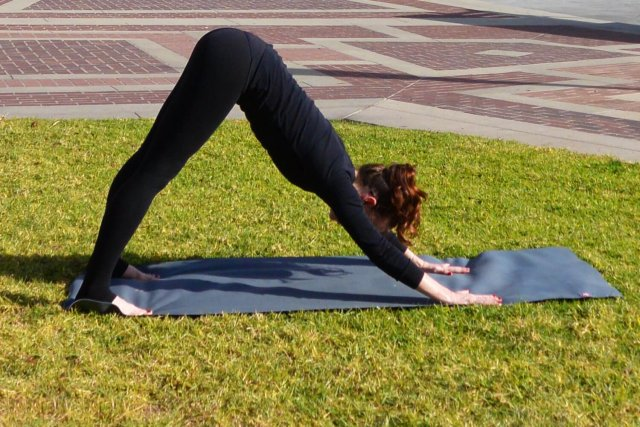
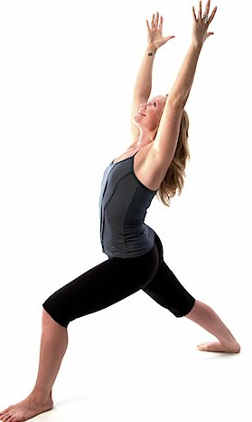
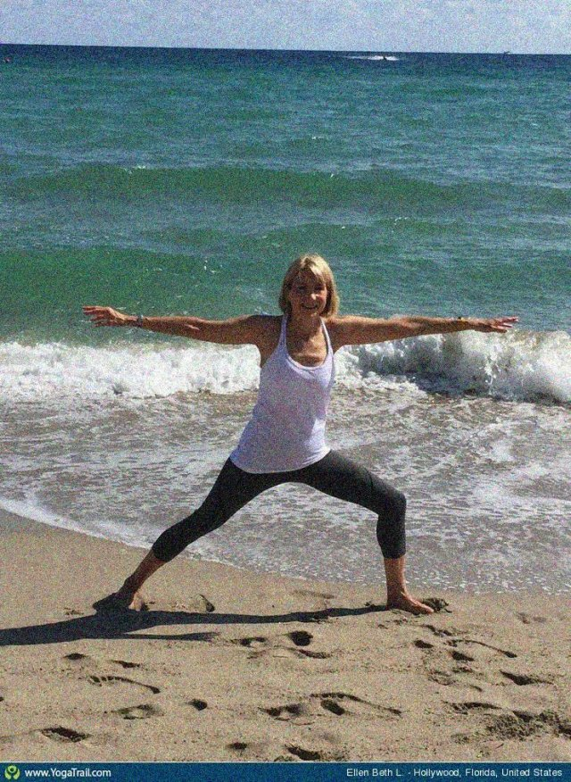
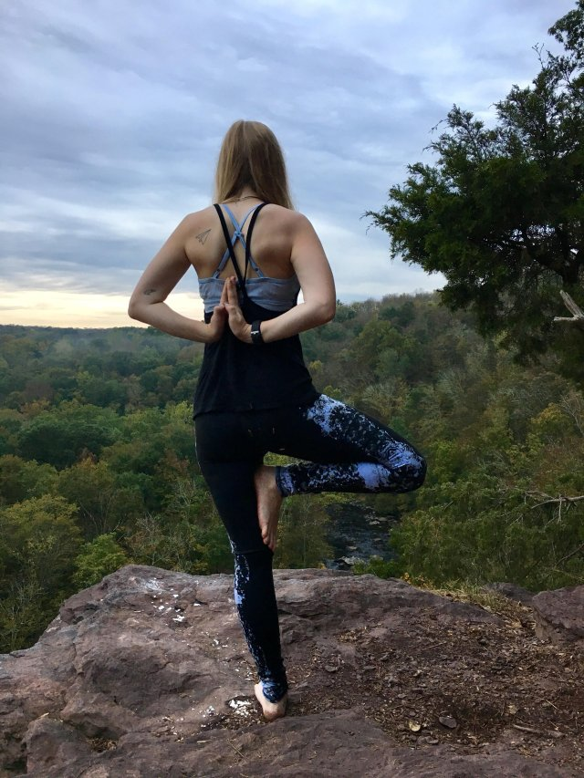
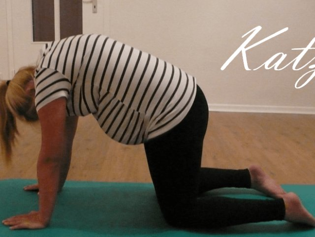
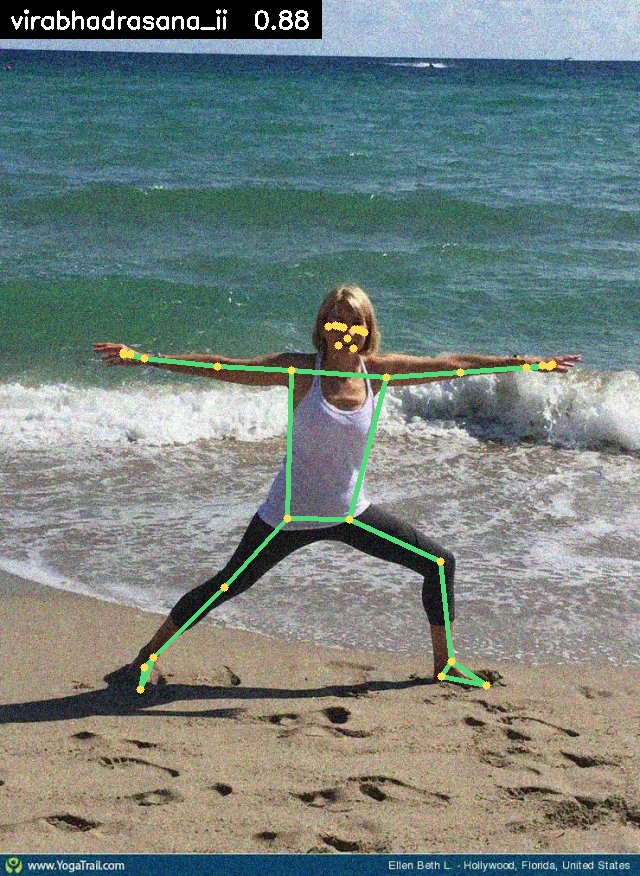
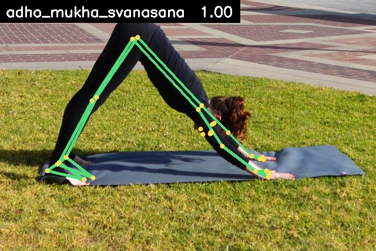
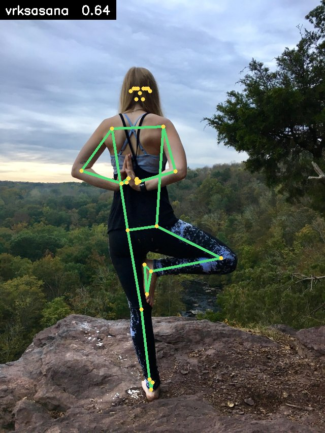
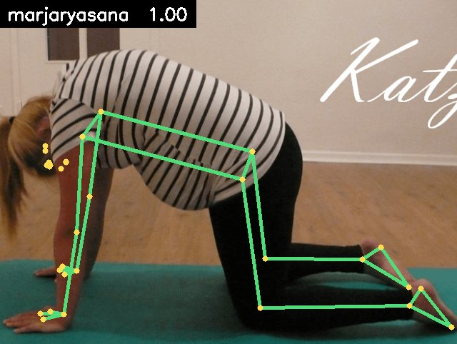

# Yoga Poser

Real-time yoga pose detector. Webcam frames flow from a React frontend to a FastAPI backend that runs MediaPipe Pose + a scikit-learn RandomForest classifier on a 16-dim feature vector. Form-feedback cues, hold-time tracking, and rep counting are all in.

See `docs/superpowers/specs/2026-08-12-yoga-pose-detector-design.md` for the full design.

## The 8 poses

| | | | |
|---|---|---|---|
| **Mountain**<br>Tadasana | **Downward-Facing Dog**<br>Adho Mukha Svanasana | **Warrior I**<br>Virabhadrasana I | **Warrior II**<br>Virabhadrasana II |
|  |  |  |  |
| **Tree**<br>Vrksasana | **Cobra**<br>Bhujangasana | **Child's Pose**<br>Balasana | **Cat**<br>Marjaryasana |
|  |  |  |  |

## Detection in action

MediaPipe Pose landmarks (green skeleton, yellow joints) with the RandomForest
classifier's prediction — the same pipeline `/api/predict` runs on every webcam
frame.

| | | |
|---|---|---|
|  |  |  |
|  | | |

Regenerate all images with:

```bash
backend/.venv/bin/python scripts/generate_readme_images.py
```

## Prerequisites
- Python 3.10+ (this repo pins 3.10.14 via pyenv's `.python-version`)
- Node 18+

## Quick start
```bash
# Backend
python3 -m venv backend/.venv
source backend/.venv/bin/activate
pip install -r backend/requirements.txt

# Frontend
cd frontend && npm install && cd ..

# Train (optional: ship pre-trained model under backend/models/)
python -m backend.training.download_data    # prints manual dataset steps
python -m backend.training.extract_features
python -m backend.training.train
python -m backend.training.build_templates

# Run
./scripts/dev.sh
# → open http://localhost:5173
```

## API
- `GET  /api/health`
- `GET  /api/poses`
- `POST /api/session/start`  `{target_poses?: [...]}`
- `GET  /api/session/{id}`
- `POST /api/session/{id}/reset`
- `POST /api/predict`        multipart `image`, `session_id`
- API docs: http://localhost:8000/docs

## Tests
```bash
# Backend
cd /home/sanjeew/Yoga_poser && backend/.venv/bin/python -m pytest backend/tests -v
# Frontend
cd frontend && npx vitest run
```
